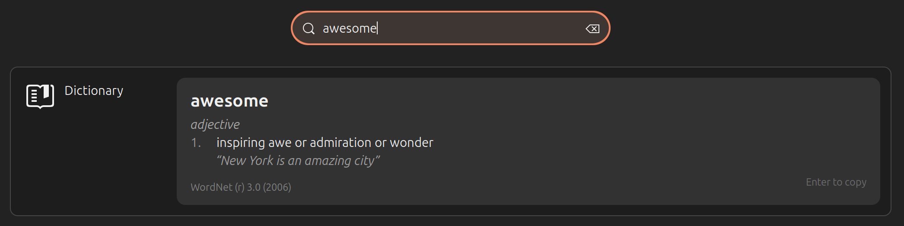

# gnome-dict

Spotlight-style dictionary lookups for GNOME Shell. Type a word into Activities
search and see its definition inline — no app to open. The backend is the
standard `dict` client talking to a local `dictd` server.



- Styled definition card (headword, part of speech, numbered senses, example)
- Enter/click copies the definition to the clipboard (a subtle "Enter to copy" hint is shown on the card)
- "Did you mean…" suggestions for misspellings
- Preferences: trigger mode, dictionary database, local-only, senses shown

**Status:** early (0.1.0). Targets **GNOME Shell 46** (Ubuntu 24.04).

## Requirements

- GNOME Shell 46
- The `dict` client and a running `dictd` server with at least one dictionary

```bash
sudo apt install dict dictd dict-wn dict-gcide dict-devil
dict serendipity   # should print a definition
```

By default only the local server is queried. Turn off "Local dictd server
only" in the preferences to also use the servers in `/etc/dictd/dict.conf`
(this sends your lookups over the network).

## Install

**From extensions.gnome.org** (once published): search for "Dictionary Search"
at <https://extensions.gnome.org/> and toggle it on.

**From a release zip:**

```bash
gnome-extensions install --force gnome-dict@jeremyckahn.github.io.shell-extension.zip
```

**From source:**

```bash
git clone https://github.com/jeremyckahn/gnome-dict.git
cd gnome-dict
make install
```

On Wayland, log out and back in so GNOME Shell picks up the new extension,
then enable it:

```bash
gnome-extensions enable gnome-dict@jeremyckahn.github.io
```

## Usage

Open Activities (Super key) and type a word, or `define <word>`. Press Enter
on the result to copy its definition. Open the preferences with:

```bash
gnome-extensions prefs gnome-dict@jeremyckahn.github.io
```

## Troubleshooting

- No result appears: check `dict <word>` works in a terminal, and that the
  extension is enabled (`gnome-extensions list --enabled`).
- Errors: `journalctl -f /usr/bin/gnome-shell`. Messages about objects "already
  disposed" from `search.js` are GNOME's own and harmless.

## Documentation

- [CONTRIBUTING.md](CONTRIBUTING.md) — development setup, architecture, testing
- [docs/RELEASING.md](docs/RELEASING.md) — building and publishing to extensions.gnome.org
- [CHANGELOG.md](CHANGELOG.md)

## License

[GPL-2.0-or-later](LICENSE).
